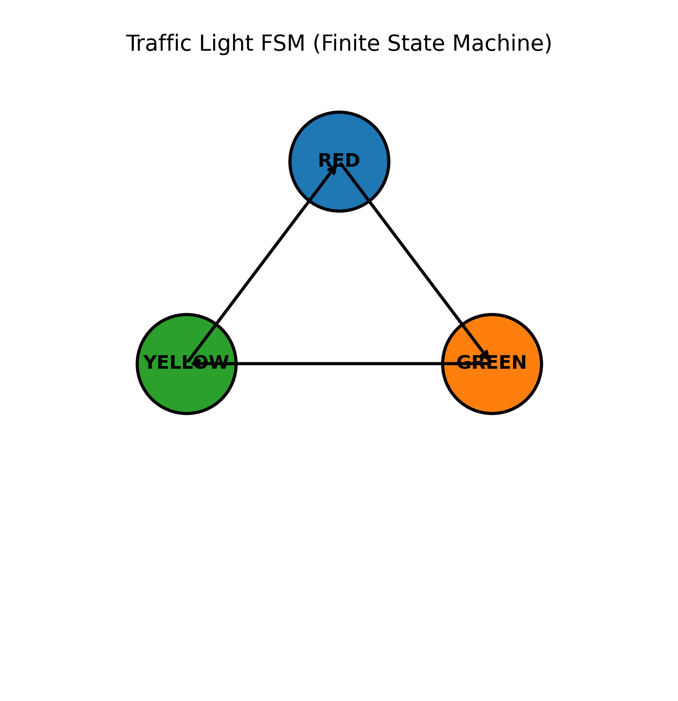
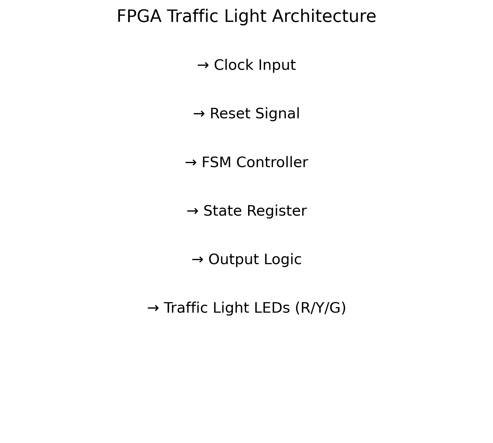
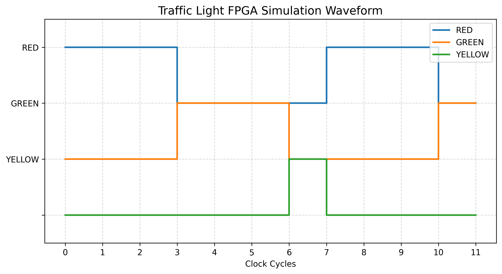
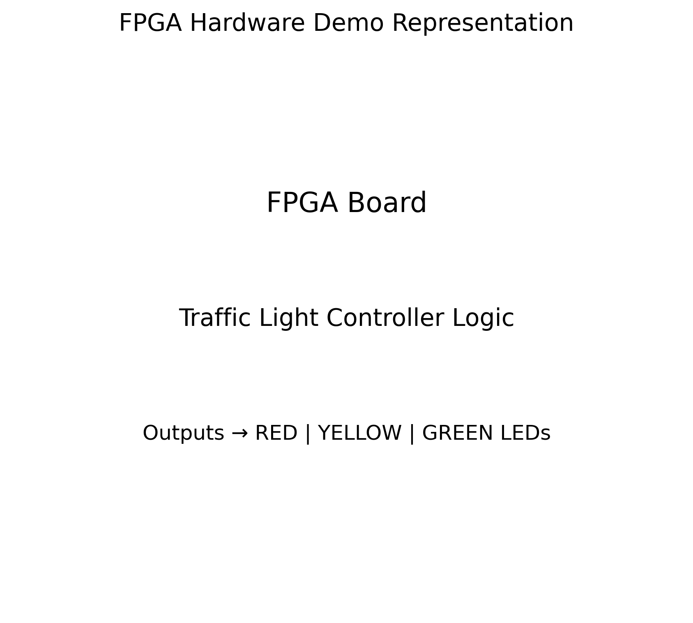

# 🚦 FPGA Traffic Light Controller (FSM Based)

## 📌 Project Overview
This project implements a Traffic Light Control System using FPGA design principles. It is based on a Finite State Machine (FSM) that controls traffic signals (RED, YELLOW, GREEN) in a sequential and timed manner. The project includes RTL design, testbench simulation, waveform generation, and Python-based visualization of hardware behavior.

---

## 🎯 Objectives
- Design a traffic light controller using FSM
- Implement digital logic using Verilog HDL
- Simulate and verify functionality using testbench
- Generate waveform and architecture visualization
- Demonstrate FPGA-based embedded system design

---

## ⚙️ Features
- Finite State Machine (FSM) based design  
- Verilog RTL implementation  
- Clock-driven state transitions  
- Testbench simulation support  
- Python-generated diagrams  
- FPGA-style waveform visualization  

---

## 🧠 Concepts Used
- Finite State Machine (Moore model concept)
- Sequential Logic Design
- Digital Electronics
- Clock-driven systems
- Hardware simulation and verification

---

## 📁 Project Structure

```text
FPGA-Traffic-Light-Controller/
│
├── images/
│   ├── fpga_hardware_demo.png
│   ├── simulation_waveform_results.png
│   ├── smart_intersection_architecture.png
│   ├── traffic_fsm_visual_diagram.png
│
├── rtl/
│   ├── clk_en.v
│   ├── debounce_sync.v
│   ├── params.vh
│   ├── timer.v
│   ├── top.v
│   ├── traffic_fsm.v
│
├── tb/
│   ├── traffic_tb.v
│
├── .gitignore
├── LICENSE
├── README.md
├── generate_images.py
---

---

## 📊 Project Outputs

### FSM Diagram
Represents state transitions between RED, YELLOW, and GREEN states.



---

### Architecture Diagram
Shows internal FPGA-based system design.



---

### Simulation Waveform
Displays clock-based signal transitions.



---

### Hardware Representation
Conceptual FPGA board output.



---

## 🧾 Working Principle
- The system operates using 3 states: RED, YELLOW, GREEN
- Each state changes based on clock cycles
- FSM ensures sequential and deterministic control flow

---

## 🧪 Simulation Details
- RTL simulated using Verilog testbench
- Output stored in `.vcd` file
- Waveform analyzed using GTKWave
- Python script used for visualization

---

## 🛠️ Tools Used
- Verilog HDL
- FPGA Simulation Tools (Vivado / ModelSim)
- Python (Matplotlib, NumPy)
- Git & GitHub

---

## 🚀 How to Run

### Generate images
py generate_images.py

---

## Run simulation

iverilog rtl/traffic_light.v tb/traffic_light_tb.v

vvp a.out

gtkwave traffic.vcd

----

📌 Applications
- Smart traffic systems  
- Embedded systems  
- FPGA-based digital design  
- Academic and lab projects  

---

📄 License  
This project is licensed under the MIT License.

---

⭐ Future Improvements
- Emergency vehicle priority system  
- Multi-lane traffic expansion  
- Adaptive smart traffic control  
- FPGA hardware implementation  

---

👨‍💻 Author  
Ananya Jain
